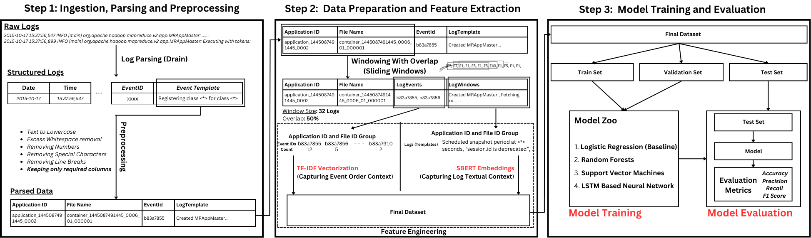
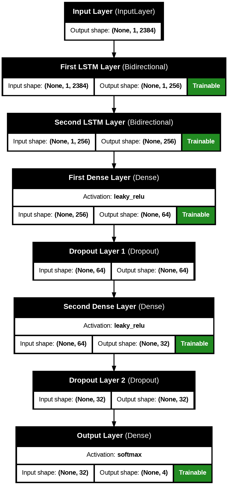

# Intelligent-Classification-of-Hadoop-Logs

## How to run the project

To run the project, follow these steps:

1. Clone the repository to your local machine:

   ```bash
   git clone https://github.com/SohamPatel0810/Intelligent-Classification-of-Hadoop-Logs.git
   ```

2. Install the required dependencies:

   ```bash
   pip install -r requirements.txt
   ```

3. Download the dataset and place it in the `data` directory. (the Hadoop dataset is already in place)

4. The first step is parsing the raw logs in the data directory. This can be done by running the parse_logs python script in the logalyzer directory.

   ```bash
   cd logalyzer
   python parse_logs.py
   ```

5. Now, for data preparation and model training, just run the train python script.

   ```bash
   python train.py
   ```

## Project Usecase

Presenting a novel approach of classifying critical Hadoop system failures using the raw logs generated by the cluster while running the application. By leveraging various natural language processing techniques, aimed to accurately identify and classify different types of system failures, enabling faster troubleshooting and resolution.

## Project Design

The overall project design can be visualized in the following image:



## LSTM Model Architecture

The architecture of the custom LSTM model we used in this project is illustrated below:



## Results

| Model                   | Accuracy | Precision | Recall | F1-Score |
| ----------------------- | -------- | --------- | ------ | -------- |
| Random Forest           | 0.63     | 0.79      | 0.38   | 0.54     |
| Logistic Regresison     | 0.76     | 0.91      | 0.59   | 0.73     |
| Support Vector Machines | 0.77     | 0.92      | 0.62   | 0.75     |
| BiLSTM Custom Model     | 0.86     | 0.93      | 0.76   | 0.85     |
